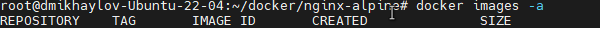
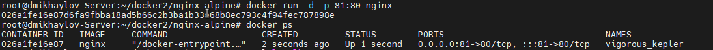

# Docker-Otus
1. Создаем  **Dockerfile**  для сборки образа. Создаем файл **nginx.conf** . Берем дефолтную страницу nginx и немного изменим ее получим файл **index.html**
2. Далее все команды под суперпользователем
3. Приступаем к сборке образа nginx:alpine   ``` docker build -t nginx:alpine . ``` При сборке в контейнер скопируются: файл nginx.conf с дополнительной конфигурацией nginx и файл index.html  с измененной дефолтной страницей 
4.  Проверяем, что получили после сборки ``` docker images -a ``
5.  
6.  docker ps -a просмотреть список всех контейнеров
7.  Запускаем контейнер с указанием проброса 81 на 80 порт и проверяем, что контейнер запущен  ``` docker run -d -p 81:80 nginx ```
8.   
9.  
10.  


